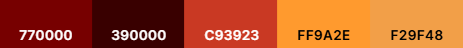
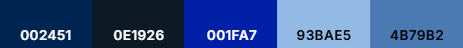
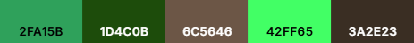
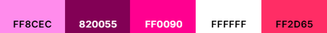

# Sudoku Discord Bot

## Puzzles
The sudoku puzzles used for this bot were sourced from [this](https://github.com/grantm/sudoku-exchange-puzzle-bank) github repository.
All puzzles are guaranteed to have a single solution.

## Commands
- [Session](#session-commands)
  - [sudoku](#sudoku) - begin a sudoku session
  - [quit](#quit) - end a sudoku session
- [Mechanics](#mechanics-commands)
  - [place](#place) - place a digit
  - [pencil](#pencil) - make pencil marks
  - [hl](#hl) - highlight or unhighlight specified digit
  - [reset](#reset) - clear all digits and pencil markings
  - [new](#new) - generate a new sudoku puzzle
- [Database](#database-commands)
  - [check](#check) - find out if you solved the sudoku
  - [save](#save) - save current sudoku board to database
  - [view](#view) - view all saved sudoku boards
- [Preferences](#preferences-commands)
  - [theme](#theme) - choose a different color theme

### Session Commands

#### /sudoku
  - Use `/sudoku` to begin a sudoku session. No other commands can be used while not in a sudoku session.

  - After selecting a difficulty, your sudoku session will begin!

#### /quit
  - Use `/quit` to end a sudoku session. This command gives you the option of saving your game before ending the session, if you choose to do so.

### Mechanics Commands
These are the commands you will use to manipulate the sudoku board.
#### /place

**\*\*All row/column indices are 1 indexed**
- `/place` takes in the digit you would like to place and the positions where you would like to place it:

The following `/place` command will place the digit '1' in positions r3c9, r8c7, r9c4, r4c5, and r5c1:

This results in the following board:

#### /pencil
#### /hl
#### /reset
#### /new

### Database Commands

#### /check
#### /save
#### /view

### Preferences Commands

#### /theme

- `/theme` takes in the name of the theme you would like to switch to and saves it in the database under 'preferences'. Your chosen theme will now be used for all displayed sudoku boards. `Dark` is set as the default theme.

|Themes||
|-|-|
| Dark |  |
| Light |  |
| Red |  |
| Blue |  |
| Shrek |  |
| Pink |  |