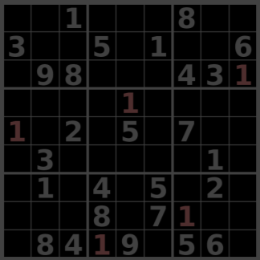
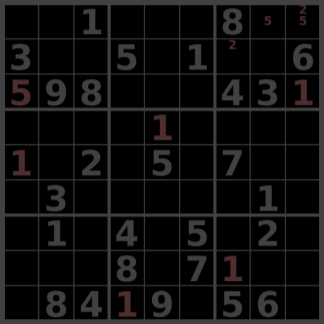

# Sudoku Discord Bot

- [Overview](#overview)
- [Puzzles](#puzzles)
- [Commands](#session-commands)
  - [Session](#session-commands)
    - [sudoku](#sudoku) - begin a sudoku session
    - [quit](#quit) - end a sudoku session
  - [Mechanics](#mechanics-commands)
    - [place](#place) - place a digit
    - [pencil](#pencil) - make pencil marks
    - [hl](#hl) - highlight or unhighlight specified digit
    - [reset](#reset) - clear all digits and pencil markings
    - [new](#new) - generate a new sudoku puzzle
  - [Database](#database-commands)
    - [check](#check) - find out if you solved the sudoku
    - [save](#save) - save current sudoku board to database
    - [view](#view) - view all saved sudoku boards
  - [Preferences](#preferences-commands)
    - [theme](#theme) - choose a different color theme

## Overview
A Discord bot allowing users to play sudoku from a Discord server.

## Puzzles
The sudoku puzzles used for this bot were sourced from [this](https://github.com/grantm/sudoku-exchange-puzzle-bank) github repository.
All puzzles are guaranteed to have a single solution.

## Session Commands
### /sudoku
  - Use `/sudoku` to begin a sudoku session. No other commands can be used while not in a sudoku session.

  - After selecting a difficulty, your sudoku session will begin!

- Attempting to use any other sudoku command while not in a session will result in the following ephemeral message:

### /quit
  - Use `/quit` to end a sudoku session. This command gives you the option to save your game before ending the session, if you choose to do so. If you do not provide this option, your game will not be saved.

## Mechanics Commands
These are the commands you will use to manipulate the sudoku board.
### /place

**\*\*All row/column indices are 1 indexed**
- `/place` takes in the digit you would like to place and the positions where you would like to place it:

The following `/place` command places the digit '1' at positions r3c9, r8c7, r9c4, r4c5, and r5c1:

which results in the following board state:

### /pencil

**\*\*All row/column indices are 1 indexed**
- `/pencil` takes in multiple digits and positions. All digits are penciled in all positions.

Before penciling:

The following `/pencil` pencils in the digit '9' at positions r1c4, r1c6, r2c7, and r2c8:

which results in the following board state:

### /hl

- `/hl` highlights all instances of the inputed digit. If a digit is already highlighted, `/hl` will first unhighlight the previously highlighted digit before highlighting the new one. If you try to highlight an already highlighted digit, `/hl` will unhighlight that digit instead.

The following `/hl` command highlights all instances of the digit '2':

which results in the following board state:

### /reset

- `/reset` reverts the current sudoku puzzle back to its default state, erasing all progress. This action is irreversable unless you have your previous progress for this puzzle saved to the database.

### /new

- `/new` gives you a new empty sudoku puzzle of the chosen difficulty. You may optionally save your current game before it is replaced by the new one.

## Database Commands

### /check

- `/check` will tell you if you have filled out the current sudoku puzzle correctly.

If you did not solve the puzzle:

Otherwise, your puzzle will be saved in 'completed games' for later viewing and you will receive a new puzzle of the same difficulty.

**\*\*You will not ever receive a puzzle you have already solved or have currently saved.**

### /save

- `/save` will save the progress of your current sudoku puzzle, overwriting duplicate puzzle save data.

### /view

- `/view` gives you the ability to look at previously saved or completed sudoku puzzles.

Here you can see I have 8 saved games and am currently viewing the third.

**\*\*Your chosen theme is also used for viewing sudoku puzzles.**

## Preferences Commands

### /theme

- `/theme` takes in the name of the theme you would like to switch to and saves it in the database under 'preferences'. Your chosen theme will now be used for all displayed sudoku boards. `Dark` is set as the default theme.

|Themes||
|-|-|
| Dark |  |
| Light |  |
| Red |  |
| Blue |  |
| Shrek |  |
| Pink |  |